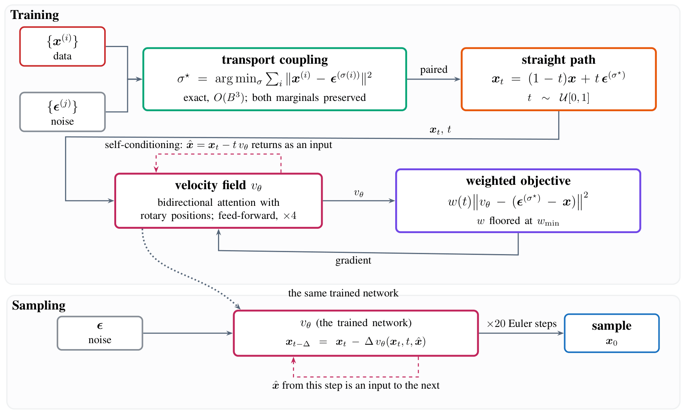
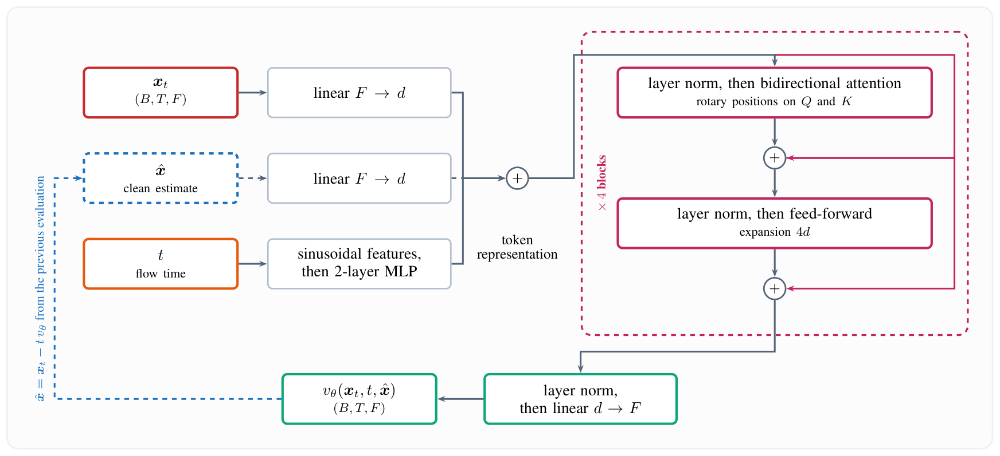
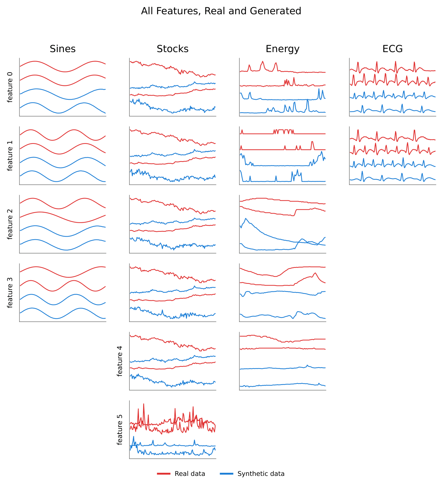

# RecFlowTime

Reference implementation of **RecFlowTime: Self-Conditioned Rectified Flow for
Time-Series Generation**.

RecFlowTime is a rectified-flow generator for multivariate time series. It
learns a velocity field along linear interpolations between data and noise and
samples by integrating that field from noise to data in **20 Euler steps**,
against 200–500 for the diffusion baselines it is compared with. Four pieces
adapt the formulation to sequences:

- a **bidirectional Transformer** over timesteps, one token per step, with
  **rotary position embeddings** so attention sees relative temporal offsets;
- **self-conditioning**, which lets each sampling step refine the previous
  step's clean-sequence estimate at no extra function evaluation;
- **minibatch optimal-transport coupling** in place of independent data–noise
  pairing, which reduces path crossings and straightens the marginal velocity
  field;
- a **floored min-SNR loss weight**, which keeps the low-noise end of the path
  supervised and reduces sample roughness.

Although it is trained unconditionally, the same model does imputation and
forecasting with no retraining and no extra function evaluations — see
[Conditional generation](#conditional-generation).

<p align="center">
  
</p>

The coupling acts only in training. At sampling time the network is run
unchanged, so nothing about the coupling is carried into generation.

<p align="center">
  
</p>

## Install

```bash
pip install -r requirements.txt
```

Runs on CPU, CUDA, or Apple Silicon (MPS); the device is selected
automatically.

## Quickstart

Three notebooks. The first writes what the other two read, so running them in
order needs no arguments.

| notebook | what it does |
|---|---|
| `01_train_and_sample.ipynb` | choose a dataset, train, sample, plot the samples |
| `02_evaluate.ipynb` | score those samples with every metric in the paper, and compare them to real data by PCA, t-SNE, value density and power spectrum |
| `03_conditional.ipynb` | impute hidden entries and forecast a held-out horizon from the trained model, without retraining |

Defaults are the reported configuration, so `01` unchanged reproduces the
paper's model for the chosen dataset. Training takes roughly 15 minutes on
Sines on an M-series GPU, and about 40, 30 and 87 minutes on Stocks, Energy and
ECG; lower `STEPS` for a faster look.

From the command line instead:

```bash
python scripts/run_variants.py --datasets sines --variants ours --steps 8000 --dir results/run
```

```bash
python scripts/evaluate_saved.py --dir results/run --suffix ours --datasets sines --repeat 2
```

## Generated samples

Real sequences against RecFlowTime samples on all four benchmarks. This is the
qualitative figure from the appendix; the metrics behind it are in
`02_evaluate.ipynb`.

<p align="center">
  
</p>

## Datasets

Four benchmarks, all included.

| dataset | $T$ | features | $N$ | source |
|---|---|---|---|---|
| Sines | 64 | 4 | 10,000 | synthetic, generated by `recflowtime/data.py` |
| Energy | 96 | 5 | 19,640 | UCI appliances energy, `data/energy_data.csv` |
| Stocks | 128 | 6 | 4,304 | Google daily prices, `data/stock_data.csv` |
| ECG | 192 | 2 | 8,000 | synthetic, generated by `recflowtime/data.py` |

`data/splits/` holds the exact train/validation/test arrays behind every number
in the paper. Every method compared against reads these same files, so no
difference in a reported score comes from a difference in data. Regenerate them
with `python scripts/export_splits.py`.

Each feature is scaled to $[-1, 1]$ using its range over all windows. Windows
are cut with stride 1. The validation split is held out but never used: no
reported run does model selection on it (`train.val_every` is set beyond the
training budget).

## Configuration

`RecFlowTimeConfig.for_dataset(seq_len, n_features, **overrides)` builds a
config. **The defaults are the reported configuration**, so the bare call is
the method as evaluated in the paper. Overrides are dotted paths such as
`core.ot_coupling`.

| key | default | meaning |
|---|---|---|
| `core.ot_coupling` | `True` | transport coupling; `False` gives independent pairing |
| `core.sampling_steps` | `20` | Euler steps per generated sequence (NFE) |
| `core.min_snr_gamma` | `5.0` | min-SNR cap |
| `core.min_snr_floor` | `0.1` | lower bound on the loss weight (see below) |
| `denoiser.use_rope` | `True` | rotary positions; `False` gives fixed sinusoidal |
| `denoiser.use_self_cond` | `True` | self-conditioning |
| `denoiser.d_model` | per dataset | 96 / 112 / 128 / 160 for Sines / Energy / Stocks / ECG |
| `train.batch_size` | `128` | also the size of each assignment problem |
| `train.warmup_steps` | `8000` | training steps; the reported budget |

**The min-SNR floor.** The standard min-SNR weight vanishes as $t \to 0$: it is
below $10^{-3}$ at $t = 0.01$, leaving the low-noise end of the path almost
unsupervised. That is the region where the velocity field determines local
smoothness, and without supervision there the samples come out rougher than the
data. `min_snr_floor` clamps the weight from below; setting it to 0 reproduces
plain min-SNR.

`AuxConfig`, `SpectralConfig` and `DistConfig` control optional objective terms
that are **disabled by default** and contribute to no reported number. They are
retained so the development runs stay reproducible.

## Conditional generation

Because the forward process is the straight interpolation
$x_t = (1-t)\,x + t\,\varepsilon$, the observed entries of a target can be
carried to the noise level of the current integration step in one line and
written back after every Euler step; at $t = 0$ they are reproduced exactly.
Nothing about the model changes, no gradient is taken, and sampling still costs
20 function evaluations.

```python
from recflowtime.conditional import impute_mask, forecast_mask, complete_k, scores

keep  = impute_mask(real.shape, ratio=0.5)        # True where observed
preds = complete_k(model, core, dcfg, real * keep, keep, steps=20, k=10)
print(scores(preds, real, keep))                  # mse_mean, crps, ...
```

The mask never enters training, so any observation pattern works at inference:
scattered gaps, a whole feature missing, a forecast tail, or any combination.
`03_conditional.ipynb` walks through both tasks and reproduces the appendix.

A note on scoring. A generative model returns a *sample* from the conditional
distribution, whereas squared error is minimised by the conditional *mean*, so
scoring a single draw penalises a calibrated model by construction. `scores`
therefore reports the error of the K-sample mean and CRPS, a proper scoring
rule, alongside the single-draw value.

## Ablations

`scripts/run_variants.py` takes a `--variants` list. Each arm changes exactly
one thing relative to `ours`.

| arm | change |
|---|---|
| `ours` | the full method |
| `no_ot` | independent pairing instead of the transport coupling |
| `no_rope` | fixed sinusoidal positions instead of rotary |
| `no_selfcond` | self-conditioning branch removed |
| `no_minsnr` | uniform loss weight (removes min-SNR and its floor together) |
| `floor000` | min-SNR kept, floor removed — isolates the floor |
| `ddpm_core` | eps-prediction DDPM/DDIM core, coupling and floor retained |

`floor005` and `floor010` are the remaining points of the floor sweep.
`no_selfcond` also removes the parameters of the self-conditioning branch, so
it is not parameter-matched to the other arms.

## Evaluation

`scripts/evaluate_saved.py` recomputes every metric from saved samples, so it
needs no retraining. Metrics split into two kinds, and the difference matters
when reading small gaps.

*Learned* — discriminative, predictive, Context-FID — train a network on the
samples and therefore carry estimator variance even when the samples are fixed.
We measured the discriminative score's spread at 0.02–0.11 across evaluator
seeds on fixed data, which exceeds many published gaps between methods on these
benchmarks. Report them with error bars and state the number of seeds.

*Deterministic* — correlational, spectral, increment, autocorrelation — are
closed-form functions of the samples and carry no evaluator variance, so
differences in them are exact.

`--repeat` sets the number of evaluator seeds; `--cfid-repeat` sets the number
of encoder fits behind Context-FID separately, because each one refits TS2Vec
and dominates the runtime. `recflowtime/benchmark_metrics.py` implements the
stricter published protocol used for the cross-paper comparison.

## Layout

```
recflowtime/
  flow.py           rectified flow, the transport coupling, the floored min-SNR weight
  conditional.py    imputation and forecasting by masked replacement
  denoiser.py       the Transformer velocity field
  modules.py        attention, RoPE, time embedding
  diffusion.py      DDPM/DDIM core, for the ddpm_core ablation arm
  config.py         all configuration; the defaults are the reported setting
  train.py          training loop, EMA, sampling
  metrics.py        the evaluation metrics
  benchmark_metrics.py  the stricter published protocol
  ts2vec.py         the Context-FID representation
  data.py           dataset construction and splitting
  losses.py         the objective; the flow loss plus the optional terms
  viz.py            plotting helpers for a training report
  spectral.py       ) optional objective terms, disabled by default
  distributional.py )   and contributing to no reported number
  masking.py        )   (see Configuration, above)
  aux_nets.py       )
scripts/            command-line training, evaluation, split export
docs/               figures used by this README
data/               CSV sources and the exact splits used in the paper
```

## Reproducing the paper

The reported configuration is 8,000 training steps, 20 sampling steps, batch
size 128, `min_snr_floor` 0.1, one training seed, two evaluation seeds. Model
width per dataset is in the table above; every other setting is the default.

Results are reported as mean ± standard deviation over evaluation seeds. That
spread covers evaluator variance only — it does not cover variance across
training seeds, and we do not claim the ranking is stable across
initialisations.
